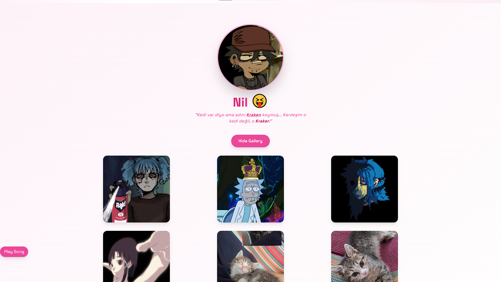

# Who is Nil? 😝

Tatlı mı tatlı, pembiş mi pembiş bir frontend deneyimi.  
Ama bu sıradan bir "kişisel tanıtım" sitesi değil... Bu **Nil**, ve onun evreni!  
Kah güldürür, kah "Kraker" diye düşündürür. Kimi zaman galeri açar, kimi zaman kalbe dokunur.

## ✨ Özellikler

- 🔥 TailwindCSS ile responsive tasarım (mobilde bile tatlı).
- 🎵 Otomatik müzik başlatma (isteğe bağlı butonla kontrol).
- 🖼️ Galeri sistemi (animasyonlu, modal açılır).
- 😝 Profil resmi zoom özelliği.
- 💖 Eğlenceli footer, animasyonlu emojiler.
- 🐱 "Kraken mi? Yok kanka, Kraker!"

## 🧠 Kullanılan Teknolojiler

- React + Vite
- TailwindCSS
- TypeScript (isteğe bağlı)

## 🧰 Kurulum

```bash
git clone https://github.com/TPashaxrd/whois-nil.git
cd nil-project
npm install
npm run dev
```

> Not: `src/song.mp3` dosyasını **sen kendin** eklemelisin. Telif melif uğraşma.

## 🧑‍💻 Yapımcılar

| İsim | Ünvan |
|------|-------|
| **Toprak** | 🔥 Kurucu & Karizma Yönetmeni |
| **Nil** | 😝 Nil Kim Mi? |

## 📝 Lisans

[MIT](./LICENSE)

> “Kalbe dokunmayan komponent, sadece `<div>`tir...” – bir frontend filozofu

## 🐙 Örnek Ekran Görüntüsü



## 🧃 Ekstra Not

- Bu proje “flört gibi ama sevgili değil” hissi verir. O yüzden abartmadan sev.
- Nil’in kedisi gerçekten var mı bilmiyoruz. Ama **Kraker** bizden biri.

---

> “Dünya karışık olabilir ama kodlarımız düzenli, renklerimiz pembe.”  
> — Toprak 👑